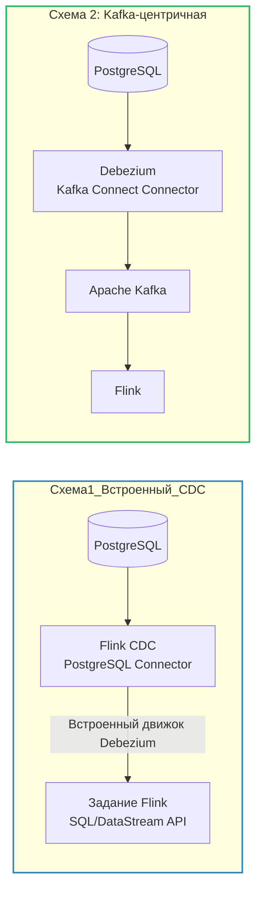

# Debezium vs две архитектуры CDC Apache Flink
> немного путаюсь по поводу дебезиума  
> получается, что флинк может работать как с дебезиумом (через его коннекторы), так и вообще без него (через стандартные коннекторы)?  
> т.е. какую роль для кластера флинка играет дебезиум?  
> флинк и без него может организовать непрерывную вычитку данных из источника или нет?  
> или дебезиум делает это как-то лучше чем флинк?  
> зачем нужен дебезиум в схеме непрерывной интеграции и нужен ли вообще?  

Именно здесь и кроется ключевое различие, которое часто вызывает путаницу. В вашем вопросе лежит понимание двух разных архитектур CDC в экосистеме Apache Flink, и вам нужно выбрать одну из них.

Проще говоря, **Flink может работать как *с использованием Debezium*, так и *без него***. Но в контексте Flink CDC, который мы обсуждали, он всегда работает **без** отдельного сервиса Debezium — его функционал **встраивается** в сам Flink-коннектор для чтения данных.

Давайте рассмотрим обе схемы и их фундаментальные отличия.

### 🆚 Сравнение двух архитектур
Ниже приведена визуальная схема, которая поможет разложить все по полочкам:

### 📘 Подробный разбор роли Debezium в каждой схеме
Теперь, смотря на схему, разберем каждый случай детально.

| Характеристика | **1. Flink CDC Connectors (Встроенный движок)** | **2. Классический Debezium + Kafka Connect** |
| :--- | :--- | :--- |
| **Роль Debezium** | **Библиотека (Debezium Engine)**, встроенная в коннектор Flink. | **Отдельный сервис (Kafka Connect Connector)** в рамках инфраструктуры Kafka. |
| **Архитектура** | Однослойная. Flink напрямую подключается к источнику, нет зависимостей от Kafka Connect. | Многослойная. Обязательно требуется развернутый кластер Kafka и Kafka Connect для передачи данных в Flink. |
| **Как работает** | Коннектор Flink использует Debezium как библиотеку для чтения WAL через слот репликации и конвертирует события в поток данных Flink. | Debezium читает WAL и публикует события в топики Kafka. Flink подключается к этим топикам как обычный потребитель. |
| **Где нужен Flink** | Используется с самого начала как движок для чтения, обработки и доставки данных. | Включается в процесс **после** Kafka для сложной обработки (агрегация, обогащение). |

### ❓ Что выбрать для вашей задачи?
Для вашей цели — **синхронизировать почти все таблицы с минимальными усилиями** — **Flink CDC Connectors (схема №1) является идеальным выбором**.

Он соответствует вашему техническому требованию **тонкой настройки репликации** и предоставляет прямое управление, а также значительно **упрощает развертывание**, так как не требует дополнительных кластеров Kafka и Kafka Connect.

> **Важно**: При работе со **Flink CDC YAML** вы используете именно первый подход. В документации говорится, что за кулисами YAML-пайплайн разворачивает стандартный `flink-sql-connector-postgres-cdc`, который использует встроенный движок Debezium.

### 💎 Итог
*   **Debezium — это не отдельная служба, а библиотека** для чтения журналов транзакций.
*   **Flink CDC Connectors** (включая YAML) используют эту библиотеку внутри себя, позволяя работать напрямую.
*   **Классическая схема с Kafka Connect** — это альтернативный способ, где Debezium и Kafka выступают в качестве промежуточного слоя.

Таким образом, Flink действительно может организовать непрерывную вычитку данных **без** внешнего Debezium, используя его только как встроенную библиотеку. Для вашего проекта **нет необходимости** разворачивать отдельный Debezium и Kafka.

# Уточнение про параметры настройки debezium в каждой из архитектур
> т.е. получается, что вот [этот параметр](https://nightlies.apache.org/flink/flink-cdc-docs-release-3.5/docs/connectors/pipeline-connectors/postgres/#:~:text=wal%20log%20offsets.-,debezium.*,-optional)  
> предназначен для настройки поведения встроенной библиотеки дебезиума в составе Apache Flinf CDC  
> я правильно понимаю?

Параметры с префиксом **`debezium.*`** предназначены именно для тонкой настройки поведения **встроенного** движка Debezium внутри Flink CDC, будь то в коннекторе SQL или в декларативном YAML-пайплайне.

### 📝 Сравнение настроек Debezium в разных подходах

Настройки в основном одинаковые, но способ их указания отличается:

| Аспект | **Flink SQL Connector** | **Flink CDC YAML Pipeline (3.5+)** |
| :--- | :--- | :--- |
| **Ключевой параметр** | `'debezium.<property.name>' = '<value>'` | `debezium.<property.name>: <value>` |
| **Контекст** | В блоке `WITH (...)` при создании таблицы в SQL. | В секции `source:` YAML-файла конфигурации. |
| **Назначение** | Передать свойство напрямую встроенному Debezium Engine. | Передать свойство напрямую встроенному Debezium Engine. |
| **Пример (пропуск удалений)** | `'debezium.skipped.operations' = 'd'` | `debezium.skipped.operations: d` |
| **Пример (режим снапшота)** | `'debezium.snapshot.mode' = 'initial'` | `debezium.snapshot.mode: initial` |

### 🎯 Почему это ключевой механизм для тонкой настройки

Через параметры `debezium.*` вы получаете доступ к тем самым низкоуровневым функциям, о которых мы говорили:

1.  **Управление репликационным слотом**:
    *   `debezium.slot.drop.on.stop` — автоматически удалить слот при остановке задания (осторожно, может нарушить семантику at-least-once).
    *   Имя слота также можно задать через основной параметр `slot.name`.

2.  **Контроль над начальным снимком (Snapshot) и чтением WAL**:
    *   `debezium.snapshot.mode` — определяет стратегию (например, `initial`, `never`).
    *   `debezium.heartbeat.interval.ms` — критически важный параметр для контроля роста слота путём отправки служебных событий.

3.  **Фильтрация данных и операций**:
    *   `debezium.skipped.operations` — позволяет пропускать операции вставки (`c`), обновления (`u`) или удаления (`d`).
    *   `table.exclude.list` / `debezium.table.exclude.list` — для исключения таблиц по шаблону.

4.  **Конвертация данных**:
    *   Параметры вроде `debezium.bigint.unsigned.handling.mode` позволяют точно управлять тем, как Debezium преобразует типы данных из PostgreSQL в формат Flink.

Полный список всех доступных свойств Debezium для PostgreSQL можно найти в его [официальной документации](https://debezium.io/documentation/reference/stable/connectors/postgresql.html).

### 💡 Практический вывод для вашего проекта

Для вашей задачи синхронизации почти всех таблиц с минимальными усилиями через **Flink CDC YAML**:

1.  **Выбор таблиц**: Используйте параметры `tables` (с регулярными выражениями) и `tables.exclude` в секции `source` YAML-файла, чтобы указать нужные схемы и таблицы.
2.  **Тонкая настройка репликации**: Все параметры управления слотом, снапшотом и heartbeat настраиваются либо напрямую (например, `slot.name`, `heartbeat.interval`), либо через префикс `debezium.*` в том же YAML-файле.

Таким образом, вы получаете баланс: **декларативный YAML** упрощает развертывание, а **параметры `debezium.*`** дают необходимый контроль над репликацией.

