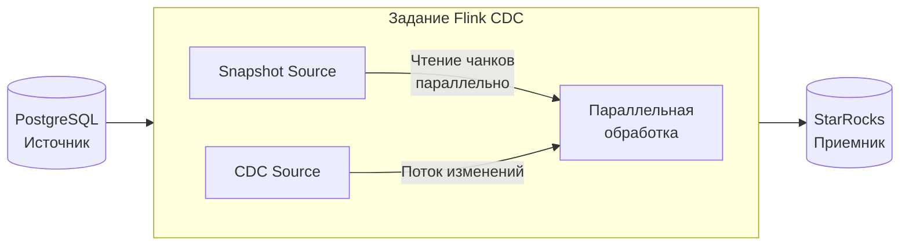

# [Flink CDC for Postgres: Lessons Learned](https://sap1ens.com/blog/2022/07/10/flink-cdc-for-postgres-lessons-learned/)
Автор статьи (Sap1ens) делится реальным опытом настройки **Flink CDC для PostgreSQL в продакшене** и описывает ряд нетривиальных проблем, с которыми столкнулся. Его ключевые выводы и "уроки" очень полезны для понимания тонкостей, которые мы обсуждаем.

### 📚 Основные уроки, извлечённые автором
Если кратко, автор столкнулся с проблемами в четырёх ключевых областях:

| "Урок" | Проблема | Решение/Рекомендация |
| :--- | :--- | :--- |
| **1. Режим снапшота (Snapshot) и консистентность** | Режим `initial` блокирует таблицы для согласованного снимка, что может быть неприемлемо для больших продакшен-таблиц. | Использовать **новый режим инкрементального снапшота (`incremental snapshot`)**, который появился в более свежих версиях и не требует длительных блокировок. |
| **2. Управление репликационным слотом** | При остановке задания Flink слот репликации в PostgreSQL мог "зависнуть", продолжая накапливать WAL и приводя к переполнению диска. | **Явно управлять жизненным циклом слота**: настраивать `heartbeat.interval.ms`, задавать уникальное `slot.name` и вручную удалять слоты через `pg_drop_replication_slot` при необходимости. |
| **3. Обработка схемы (Schema) и DDL** | Flink CDC "нативно" плохо обрабатывает изменения схемы (ALTER TABLE, добавление столбцов) в потоковом режиме. Приходилось перезапускать задания. | В версиях на момент написания статьи приходилось **разрабатывать свою стратегию**: либо отключать синхронизацию схемы и управлять ей вручную, либо обрабатывать события DDL кастомной логикой. |
| **4. Типы данных и их преобразование** | Некоторые типы данных PostgreSQL (например, `money`, пользовательские типы, массивы) некорректно или не полностью обрабатывались коннектором. | **Делать предварительный анализ типов данных** и, возможно, добавлять промежуточные преобразования (например, через Flink SQL или кастомные функции). |

### 🎯 Как это связано с вашей целью
Почти все "боли", описанные автором, напрямую касаются ваших планов по **тонкой настройке репликации** и **стабильной работе в продакшене**. Вот ключевые параллели:

1.  **Ваш запрос на "тонкую настройку"** полностью оправдан. Автор на практике подтверждает, что без тонкой настройки (`heartbeat`, `slot.name`) и понимания работы снапшота можно столкнуться с критическими проблемами (переполнение диска, блокировки).
2.  **Контроль над слотом**, который вы хотите иметь (например, через `slot.name` и `publication.name`), — это не просто удобство, а **необходимость** для стабильной работы, чтобы избежать "зависания" слотов.
3.  **Flink CDC YAML** (о котором мы говорили) — это более новая абстракция. Она может частично автоматизировать рутину, но, судя по урокам автора, понимание того, **что происходит "под капотом"** (режимы снапшота, поведение слота, обработка типов данных), остается критически важным даже при использовании декларативного подхода.

### 💡 Практические советы из статьи для вашего проекта
На основе опыта автора я бы рекомендовал при планировании вашей синхронизации:

*   **Используйте современную версию Flink CDC** (3.х), где доступен **инкрементальный снапшот (`scan.incremental.snapshot.enabled=true`)**. Это решит проблему с блокировками таблиц при старте.
*   **Обязательно настройте `heartbeat.interval.ms`** в параметрах источника (через `debezium.heartbeat.interval.ms` в YAML), чтобы слот репликации не рос бесконтрольно при отсутствии изменений в данных.
*   **Заранее проанализируйте типы данных** в своих таблицах PostgreSQL на предмет нестандартных типов (массивы, JSONB, пользовательские типы) и протестируйте их преобразование в StarRocks.
*   **Продумайте стратегию обработки DDL**. Если в вашей схеме таблиц часто происходят изменения (добавляются столбцы), проверьте, как с этим справляется Flink CDC YAML. Вам может понадобиться дополнительная логика перезапуска пайплайна.

**Резюме**: Автор не отговаривает от использования Flink CDC, а наоборот, даёт чеклист критически важных моментов для его успешного применения. Его опыт — это отличное практическое руководство для вашей настройки. Если какой-то из описанных им аспектов (например, работа со слотами или типами данных) требует более детального разбора, мы можем остановиться на нём подробнее.

# Замечания и размышления
> еще интересен момент,  
> где автор говорит об однопоточной настройке репликации  
> Flink CDC source can only be run with a parallelism of 1.
> As far as I understand, this is because Debezium embedded engine uses a single thread for reading replicated messages.
> This means that there is an upper bound on the source throughput.
> и [вот тут](https://sap1ens.com/blog/2022/07/10/flink-cdc-for-postgres-lessons-learned/#replication-slots)
> получается, Flink CDC работает только в одном потоке?
> или это рекомендация так работать, в таком режиме?
> получается, если у меня неск сот таблиц, десяток из которых достаточно большие, я буду делать его неск суток?

Давайте проясним ключевой момент из статьи. Автор говорит об ограничении **Flink CDC Connector** для PostgreSQL (вероятно, версии ~2.x), которое с 2022 года **значительно улучшено**. Вот сравнительная таблица, чтобы было наглядно:

| Аспект | Ограничение в статье (2022 г., Flink CDC 2.x) | Современное положение (Flink CDC 3.x / YAML) |
| :--- | :--- | :--- |
| **Параллелизм Source (чтение из PostgreSQL)** | Источник мог работать **только с параллелизмом 1** для одной таблицы. | Параллелизм для источника задается в `pipeline` секции YAML (напр., `parallelism: 2`) и применяется к заданию в целом. |
| **Параллельная обработка** | Из-за однопоточного источника общая пропускная способность задания была ограничена. | Дальнейшая обработка после источника (фильтрация, трансформации) может выполняться параллельно несколькими подзадачами. |
| **Чтение начального снапшота (Snapshot)** | Могло выполняться медленно и с блокировками таблиц. | Поддерживается **инкрементальный снапшот** (Incremental Snapshot), который читает данные параллельными "чанками" без длительных блокировок. |
| **Итоговый эффект** | Синхронизация больших таблиц могла занимать действительно долгое время (часы/сутки). | Скорость синхронизации определяется **не только источником, но и возможностью параллельной обработки** и использованием оптимизированного снапшота. |

**Выводы для вашего проекта**:
1.  **Ограничение 2022 года устарело**. С современными версиями Flink CDC (особенно 3.x и декларативными YAML-пайплайнами) ситуация иная.
2.  **Скорость синхронизации повышена**. За счёт оптимизаций снапшота и параллельной обработки внутри задания, синхронизация десятков таблиц (включая крупные) должна проходить **значительно быстрее**, чем описанные в статье "сутки".
3.  **Рекомендация**: Используйте Flink CDC 3.5+ с **декларативным YAML-пайплайном**, так как он автоматически использует новые возможности, такие как инкрементальный снапшот и управление параллелизмом задания.

Для наглядности, вот как выглядит поток данных и распределение задач в такой современной архитектуре:

Таким образом, ваши опасения, основанные на старой статье, **сейчас в значительной степени сняты**. Конечно, абсолютная скорость будет зависеть от объёма данных, пропускной способности сети и производительности кластера Flink, но архитектурных ограничений на уровне одного потока больше нет.

Если хотите, можем перейти к конкретным настройкам YAML-файла для вашего случая с десятками таблиц.
