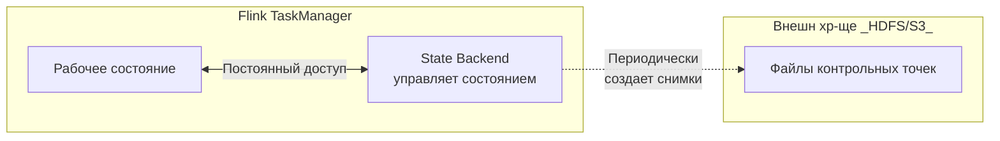

# [7 Tips For Optimizing Apache Flink Applications](https://shopify.engineering/optimizing-apache-flink-applications-tips)
Статья от инженеров Shopify представляет собой практическое руководство по оптимизации ресурсоёмких приложений Apache Flink, основанное на их реальном производственном опыте.

Основное внимание в ней уделяется трём ключевым областям: использованию правильных инструментов для профилирования, выбору эффективных сериализаторов и тонкой настройке конфигурации в зависимости от рабочих нагрузок.

### 📊 Ключевые рекомендации из статьи

| Область оптимизации | Конкретные действия и инструменты | Ожидаемый эффект и практическое применение |
| :--- | :--- | :--- |
| **Инструменты для анализа производительности** | **Async-profiler** для анализа CPU и аллокаций (flame graphs). **VisualVM** для интерактивной отладки памяти. **jemalloc + jeprof** для долгосрочного мониторинга и поиска утечек. **Eclipse MAT** для глубокого анализа дампов кучи. | Поможет точно найти "узкие места" в коде и конфигурации, вместо гаданий. Применяйте для диагностики проблем с производительностью и памятью. |
| **Избегание медленной сериализации Kryo** | Отключение отката на Kryo (`env.getConfig().disableGenericTypes();`). Замена проблемных типов (Scala BigDecimal, ADT) на поддерживаемые (Java BigDecimal, Scala enums). | **До 20% роста производительности**. Обязательный шаг при падении производительности: отключите и исправьте ошибки сериализации. |
| **Адаптивная настройка под нагрузку** | **Backfill** (исторические данные): максимум входных партиций, контроль за Back Pressure, снижение частоты чекпоинтов, увеличение сетевых буферов. **Steady state** (реальное время): приоритет свежести данных, высокая частота чекпоинтов для быстрого восстановления. | Позволяет гибко управлять кластером. Создавайте разные профили конфигурации для этапов первоначальной загрузки данных и постоянной работы. |
| **Оптимизация File Sink** | Использование `keyBy()` для правильной группировки данных перед записью в файлы, чтобы уменьшить количество открытых "ведер" (buckets) в памяти каждого TaskManager. | Предотвращает катастрофические утечки памяти (OOM) при записи большого числа партиций. Критически важно при использовании File Sink с большим числом уникальных ключей. |

### 💡 Практический вывод для вашего проекта

Эти рекомендации полностью применимы и для Flink CDC-пайплайнов, которые вы настраиваете.

*   **Начните с инструментов**: Если в будущем столкнётесь с падением производительности или ростом лага, используйте **Async-profiler** или **VisualVM** для анализа, прежде чем что-либо менять.
*   **Проверьте сериализацию**: Убедитесь, что в вашем Flink Job, который использует CDC-коннектор, отключён откат на Kryo.
*   **Настройте чекпоинты под задачу**: Для длительной начальной синхронизации (backfill) увеличьте интервал чекпоинтов, чтобы снизить накладные расходы. Для режима реального времени — уменьшите интервал для быстрого восстановления.

Инженеры Shopify подчёркивают, что **настройка зависит от конкретной нагрузки**, и универсального рецепта нет. Рекомендации стоит воспринимать как набор проверенных методов, которые нужно адаптировать.

# RocksDB
> можем ли мы применять RocksDB в качестве State Backend с учетом наших требований (бесплатное использование в составе своего поставляемого ПО)?

Да, вы можете **свободно и бесплатно использовать RocksDB в качестве State Backend** в составе своего коммерческого ПО. RocksDB является ключевым компонентом Apache Flink и распространяется под его лицензией. Это один из трех встроенных бэкендов состояния, доступных в дистрибутиве Flink.

Чтобы помочь вам определиться с выбором, взгляните на сравнительную таблицу ключевых характеристик разных State Backend в Flink:

| Характеристика | **EmbeddedRocksDBStateBackend** | **HashMapStateBackend** (ранее FsStateBackend) | **MemoryStateBackend** |
| :--- | :--- | :--- | :--- |
| **Где хранится рабочее состояние** | На **локальном диске** (оперативное) | В **куче JVM** (оперативная память) | В **куче JVM** (оперативная память) |
| **Где хранятся снапшоты** | Удаленное файловое хранилище (HDFS, S3 и др.) | Удаленное файловое хранилище (HDFS, S3 и др.) | Куча JobManager (не для продакшена) |
| **Поддержка инкрементальных чекпоинтов** | **Да** | Нет | Нет |
| **Макс. объем состояния** | Ограничен **дисковым пространством** кластера | Ограничен **доступной оперативной памятью** | Очень мал (только для тестов) |
| **Производительность (задержка)** | Ниже (требует сериализации) | **Выше** (работа с данными в памяти) | Самая высокая (но непригодна для прода) |
| **Подходит для** | Больших состояний, инкрементальных чекпоинтов | Состояний, помещающихся в память, с требованием к низкой задержке | Локальной разработки и отладки |

### ✅ Почему RocksDB — подходящий выбор для вашего сценария
Основываясь на нашем обсуждении вашего проекта, **RocksDB (EmbeddedRocksDBStateBackend) — это хороший вариант по умолчанию** по нескольким причинам:
*   **Бесплатная лицензия Apache 2.0**: Вы можете использовать и распространять его без лицензионных отчислений.
*   **Поддержка больших состояний**: Если ваши Flink-задания (особенно для обработки больших таблиц) будут накапливать значительный volume state, RocksDB справится с этим, используя диск.
*   **Инкрементальные чекпоинты**: Эта функция, уникальная для RocksDB, ускоряет создание контрольных точек, что критически важно для стабильности заданий с большим состоянием.

### ⚙️ Практические шаги по настройке
Если вы решите использовать RocksDB, настройка довольно проста:

1.  **На уровне кластера**: Добавьте в `conf/flink-conf.yaml`:
    ```yaml
    state.backend: rocksdb
    state.checkpoints.dir: hdfs:///flink/checkpoints  # или путь к вашему S3/GCS
    state.backend.incremental: true  # Включаем инкрементальные чекпоинты
    state.backend.rocksdb.localdir: /path/to/fast/local/ssd  # Важно для производительности
    ```
2.  **На уровне задания**: В коде задания установите бэкенд программно.

### ⚠️ Что нужно учитывать: производительность
RocksDB имеет свою цену в виде производительности. Из-за необходимости сериализации данных и работы с диском доступ к состоянию в **10 раз медленнее**, чем при использовании бэкендов, хранящих данные в куче.

Если ваши задания работают с **небольшим объемом состояния, который гарантированно помещается в память**, и вам критически важна **минимальная задержка**, рассмотрите `HashMapStateBackend` (FsStateBackend во Flink < 1.13).

> **Совет**: Как видно из таблицы, начиная с Flink 1.13, можно легко переключаться между бэкендами. Вы можете начать с `HashMapStateBackend`, а при росте состояния создать savepoint и восстановить задание с `RocksDBStateBackend`.

# States
> а что есть hdfs? что он дает? насколько сложно в нем разобраться и применить? нужен ли он в нашей концепции или без него можно спокойно обойтись?
> он обязательно нужен для указанной конфигурации (EmbeddedRocksDBStateBackend - state.checkpoints.dir: hdfs:///flink/checkpoints) или в варианте с RocksDB без него можно обойтись?

На основе ваших вопросов, давайте разделим понимание HDFS и его роли в работе Flink на несколько ключевых уровней.

### 🔍 Что такое HDFS?
**HDFS (Hadoop Distributed File System)** — это распределённая файловая система, созданная для надёжного хранения огромных массивов данных на дешёвом оборудовании. Её архитектура построена на принципе **WORM (Write Once, Read Many)**: файл записывается один раз, но читаться может многократно.

| Основные компоненты HDFS | Их роль |
| :--- | :--- |
| **NameNode** | Главный узел управления. Хранит метаданные (структуру каталогов, информацию о блоках файлов) и является критической точкой системы. |
| **DataNode** | Рабочие узлы, которые физически хранят блоки данных (обычно по 128 МБ) и реплицируют их для отказоустойчивости. |
| **Вторичный NameNode** | Помогает NameNode в обслуживании, но **не является его "горячей" резервной копией** для восстановления при сбое. |

### 📦 Как HDFS связан с Flink?
HDFS для Flink — это, в первую очередь, **надёжное внешнее хранилище для контрольных точек (checkpoints)** и файлов сохранённых состояний (savepoints). Работающее состояние (working state) хранится локально (в памяти или на диске), а его периодические снимки отправляются в HDFS.

**Важно различать два понятия в Flink:**
1.  **Рабочее состояние (Working State)** — это то, с чем операция работает в данный момент.
2.  **Контрольные точки (Checkpoints)** — это снимки состояния, которые Flink периодически создаёт в **удалённом, отказоустойчивом хранилище** (например, в HDFS, S3) для восстановления после сбоя.

Для наглядности, вот как выглядит поток данных между рабочим состоянием Flink и HDFS:



### 🤔 Нужен ли HDFS в вашем сценарии?
Вы можете **обойтись без HDFS**, используя другие поддерживаемые распределённые файловые системы. Вот сравнительная таблица ключевых альтернатив для хранения контрольных точек:

| Альтернатива HDFS | Описание | Особенности для Flink |
| :--- | :--- | :--- |
| **Amazon S3 / S3-совместимые** (MinIO) | Объектные хранилища. Идеальны для долгосрочного хранения и масштабирования. | Стандартный выбор в облаке. Минус — чуть выше задержка по сравнению с HDFS. |
| **Google Cloud Storage (GCS)** | Объектное хранилище Google. | Полностью управляемый сервис, интеграция с Flink проста. |
| **NFS / Общая файловая система** | Сетевая файловая система, смонтированная на всех узлах кластера. | Простое решение для небольших или тестовых кластеров, но может стать узким местом по производительности и доступности. |

Даже если вы выберете **EmbeddedRocksDBStateBackend**, параметр `state.checkpoints.dir` **необязательно должен указывать на HDFS**. В конфигурации Flink вы можете указать путь к другому хранилищу, например:
*   `state.checkpoints.dir: s3://your-bucket/flink/checkpoints/`
*   `state.checkpoints.dir: file:///mnt/shared_nfs/flink/checkpoints/` (для NFS)

### ⚖️ Плюсы и минусы внедрения HDFS
Перед тем как принять решение, взвесьте следующие факторы:

*   **Преимущества HDFS**:
    *   **Высокая надёжность** за счёт репликации данных.
    *   **Высокая пропускная способность** при последовательном чтении/записи.
    *   **Горизонтальная масштабируемость** — легко добавить новые узлы DataNode.
    *   Бесплатная лицензия с открытым исходным кодом (Apache 2.0).

*   **Недостатки и сложности HDFS**:
    *   **Высокий порог входа** в эксплуатацию и обслуживание.
    *   **NameNode — единая точка отказа** (SPOF).
    *   **Плохо подходит для мелких файлов** (< 128 МБ) и частых изменений.
    *   **Требует выделенного кластера**, что увеличивает инфраструктурные затраты.

### 💡 Практические рекомендации для вашего проекта
Для вашей задачи синхронизации данных из PostgreSQL в StarRocks с помощью Flink CDC я бы рекомендовал **рассмотреть альтернативы HDFS**, особенно если вы разворачиваете систему с нуля.

В порядке приоритета:
1.  **Облачный сценарий**: Используйте нативное объектное хранилище вашего провайдера (S3, GCS). Это даст максимальную отказоустойчивость при минимальных операционных затратах.
2.  **On-premise / гибридный сценарий**: Рассмотрите развертывание **S3-совместимого объектного хранилища**, такого как **MinIO**. Это даст схожий с облаком интерфейс и снизит сложность администрирования по сравнению с HDFS.
3.  **HDFS стоит выбирать**, только если в вашей организации уже есть опытный DevOps-коллектив для поддержки Hadoop-кластера или есть другие проекты, которым HDFS критически необходим.

Для быстрого старта и тестирования можно временно использовать локальную файловую систему или NFS, но для продакшена всегда используйте распределённое отказоустойчивое хранилище, такое как S3, GCS или, при наличии экспертизы, HDFS.
