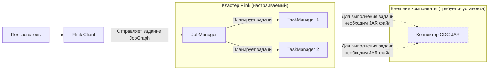

# Проверка состояния Flink кластера
Ваш вопрос о проверке кластера Flink перед накатом CDC очень правильный — начинать нужно именно с этого. Давайте разберем ключевые моменты.

### ✅ Ключевые пункты для проверки
Сначала убедитесь в исправности основных компонентов кластера:

| Компонент | **Как проверить (через командную строку)** | **Что проверить (через веб-интерфейс)** | **Цель проверки** |
| :--- | :--- | :--- | :--- |
| **JobManager (JM)** | Запрос к REST API: `curl http://<JM_HOST>:8081/taskmanagers` | В интерфейсе (`http://<JM_HOST>:8081`) на вкладке **Task Managers** должны отображаться узлы. | Подтверждает, что главный узел кластера работает и видит рабочие узлы. |
| **TaskManager (TM)** | Используйте CLI: `./bin/flink list`. Должен вернуть список заданий (возможно, пустой). | В разделе **Overview** или **Task Managers** должна быть **1+** доступная задача (Task Slot). | Подтверждает, что рабочие узлы запущены и готовы выполнять задачи. |
| **Сеть и доступ** | Проверьте подключение изнутри кластера к вашей PostgreSQL: `telnet <PG_HOST> 5432` | — | Убедиться, что кластер Flink может установить соединение с источником данных. |
| **Конфигурация Flink** | Проверьте путь к `JAVA_HOME`, версию Java (`java -version`). | На главной странице интерфейса во вкладке **Configuration** можно просмотреть ключевые параметры. | Проверка среды исполнения. |

### 🧩 Общая концепция проверки для Flink CDC
Для развертывания Flink CDC принципиально нужны все основные компоненты Flink (Client, JobManager, TaskManager), которые вы уже проверили. Ниже показано, как они взаимодействуют и в чем заключается главная подготовительная задача:



Главное, что **не является частью стандартного дистрибутива Flink** — это сам JAR-файл коннектора (например, `flink-sql-connector-postgres-cdc-3.x.jar`). Именно его вам нужно будет добавить.

### 🛠️ Рекомендуемые дальнейшие шаги

1.  **Подготовьте JAR-файлы коннекторов**. Скачайте необходимые для CDC и StarRocks коннекторы с официальных сайтов (Apache Flink CDC, StarRocks) в соответствии с вашей версией Flink.
2.  **Разместите JAR-файлы в кластере**. Разместите скачанные JAR-файлы в директорию `lib/` на всех узлах TaskManager или укажите путь к ним при запуске задания.
3.  **Проверьте подключение к PostgreSQL**. Убедитесь, что PostgreSQL на всех узлах кластера разрешает подключения от узлов Flink, и что логическая репликация (`wal_level = logical`) настроена корректно.
4.  **Запустите тестовое задание**. Протестируйте кластер и работу коннектора, запустив простую тестовую задачу (например, на чтение одной небольшой таблицы).

Помните, что Flink CDC использует встроенную библиотеку Debezium, поэтому разворачивать отдельный сервис Debezium или Kafka Connect для чтения из PostgreSQL **не нужно**.

# Проблемы с состоянием кластера
### 📊 Анализ текущего состояния
На основе команд 
```bash
$: /home/sruser# curl http://localhost:8081/taskmanagers
{"taskmanagers":[]}root@sl11-demostand-sr-01:/home/sruser#

$: /home/sruser/flink-1.20.3/bin# ./flink list
Waiting for response...
No running jobs.
No scheduled jobs.

$: /home/sruser/flink-1.20.3/bin# telnet sl11-demostand-db-01 5432
Trying xx.xx.xx.xx...
Connected to sl11-demostand-db-01.
Escape character is '^]'.
Connection closed by foreign host.
```

видно:

| Команда | Результат | Интерпретация |
| :--- | :--- | :--- |
| `curl http://localhost:8081/taskmanagers` | `{"taskmanagers":[]}` | **JobManager работает** (есть ответ на порт 8081), но **нет активных TaskManager'ов**. Это значит, что у кластера **нет вычислительных ресурсов** для выполнения задач. |
| `./flink list` | `No running jobs. No scheduled jobs.` | Это ожидаемо, если нет заданий. Основная проблема — в отсутствии TaskManager. |
| `telnet sl11-demostand-db-01 5432` | `Connected` | **Отлично!** Сетевое подключение от узла Flink к базе данных PostgreSQL есть. Это обязательное условие для CDC. |

### 🔍 Проверка Java
Судя по всему, вы находитесь в директории Flink (`/home/sruser/flink-1.20.3/bin`). Проверить версию Java можно оттуда. Вот ключевые команды:

1.  **Проверка версии Java** (главное требование Flink):
    ```bash
    $: java -version
    ```
    Для Flink 1.20 требуется **Java 11** или **Java 17**. Вывод должен быть похож на:
    ```
    openjdk version "11.0.20" 2023-07-18
    OpenJDK Runtime Environment (build 11.0.20+...)
    OpenJDK 64-Bit Server VM (build 11.0.20+..., mixed mode)
    ```

2.  **Проверка переменной `JAVA_HOME`** (она может потребоваться для скриптов):
    ```bash
    $: echo $JAVA_HOME
    ```
    Должен вернуться путь к установке JDK, например: `/usr/lib/jvm/java-11-openjdk-amd64`. Если переменная не установлена, Flink будет искать Java в системном пути.

### 🚨 Главная проблема: Отсутствуют TaskManager
**Это критично.** JobManager (веб-интерфейс работает) управляет заданиями, но **TaskManager выполняют вычисления**. Без них запустить любое задание, включая CDC, невозможно.

**Причины и решение:**
1.  **TaskManager не запущен.** В standalone-режиме (самый частый сценарий) TaskManager запускается тем же скриптом `start-cluster.sh`, что и JobManager. Возможно, при запуске возникла ошибка.
    *   **Проверьте логи запуска**: Найдите и просмотрите логи TaskManager (обычно в папке `flink-1.20.3/log/` файлы с именем `flink-*-taskexecutor-*.log` или `flink-*-taskmanager-*.log`).
    *   **Перезапустите кластер** (если это тестовая среда):
        ```bash
        # Из директории flink-1.20.3/
        $: ./bin/stop-cluster.sh
        $: ./bin/start-cluster.sh
        ```
        После этого снова проверьте `curl http://localhost:8081/taskmanagers` и веб-интерфейс.

2.  **Кластер работает в другом режиме (YARN/K8s).** Если Flink развернут на YARN или Kubernetes, TaskManager динамически выделяются при отправке задания. В этом случае нужно проверить конфигурацию диспетчера ресурсов.
    *   Как был развернут ваш кластер? Использовали `start-cluster.sh` или другие инструменты (Docker, Helm)?

### ✅ Краткий чек-лист перед установкой Flink CDC
Перед тем как устанавливать коннекторы, убедитесь в следующем:
- [ ] **TaskManager запущен и виден в веб-интерфейсе** (вкладка "Task Managers").
- [ ] **Версия Java корректна** (`java -version` возвращает 11 или 17).
- [ ] **Путь к PostgreSQL доступен** с узлов TaskManager (проверили, ок).
- [ ] **В PostgreSQL настроена логическая репликация** (`wal_level = logical`).

# Решение
Стартуем кластер
```bash
$: ./start-cluster.sh
Starting cluster.
Starting standalonesession daemon on host sl11-demostand-sr-01.
Starting taskexecutor daemon on host sl11-demostand-sr-01.

$: curl http://localhost:8081/taskmanagers
{"taskmanagers":[{"id":"0.0.0.0:44021-6a8934","path":"pekko.tcp://flink@0.0.0.0:44021/user/rpc/taskmanager_0","dataPort":36033,"jmxPort":-1,"timeSinceLastHeartbeat":1765369634808,"slotsNumber":10,"freeSlots":10,"totalResource":{"cpuCores":10.0,"taskHeapMemory":7743,"taskOffHeapMemory":0,"managedMemory":6400,"networkMemory":1600,"extendedResources":{}},"freeResource":{"cpuCores":10.0,"taskHeapMemory":7743,"taskOffHeapMemory":0,"managedMemory":6400,"networkMemory":1600,"extendedResources":{}},"hardware":{"cpuCores":4,"physicalMemory":8290181120,"freeMemory":8254390272,"managedMemory":6710886500},"memoryConfiguration":{"frameworkHeap":134217728,"taskHeap":8120172419,"frameworkOffHeap":134217728,"taskOffHeap":0,"networkMemory":1677721625,"managedMemory":6710886500,"jvmMetaspace":268435456,"jvmOverhead":1073741824,"totalFlinkMemory":16777216000,"totalProcessMemory":18119393280}}]}

```
Проверяем
```bash
# http://sl11-demostand-sr-01:8081/#/overview
Available Task Slots    10
Total Task Slots        10
Task Managers           1

# http://sl11-demostand-sr-01:8081/#/task-manager
Task Managers
Path, ID	                                            Data Port    Last Heartbeat        All Slots    Free Slots    CPU Cores    Physical MEM    JVM Heap Size    Flink Managed MEM
0.0.0.0:44021-6a8934
pekko.tcp://flink@0.0.0.0:44021/user/rpc/taskmanager_0	36033	    2025-12-10 15:33:44	    10	        10	            4	        7.72 GB	        7.69 GB	        6.25 GB
```
Проверяем джаву
```bash
$: /home/sruser/flink-1.20.3/bin# java -version
openjdk version "17.0.17" 2025-10-21
OpenJDK Runtime Environment (build 17.0.17+10-Debian-1deb12u1)
OpenJDK 64-Bit Server VM (build 17.0.17+10-Debian-1deb12u1, mixed mode, sharing)

$: /home/sruser/flink-1.20.3/bin# echo $JAVA_HOME

$: whereis java
java: /usr/bin/java /usr/share/java /usr/share/man/man1/java.1.gz
```
Правим джаву
```bash
# check & backup
$: sudo nano ~/.bashrc

# check formula
$: export JAVA_HOME=$(dirname $(dirname $(readlink -f /usr/bin/java)))
$: echo $JAVA_HOME
/usr/lib/jvm/java-17-openjdk-amd64

# apply to bashrc
$: echo "export JAVA_HOME=$(dirname $(dirname $(readlink -f /usr/bin/java)))" >> ~/.bashrc
$: source ~/.bashrc

```

👏 Кластер Apache Flink теперь находится в **идеально рабочем состоянии**.   
Давайте разберём, что означают результаты ваших проверок, и составим план установки Flink CDC.

### 📊 Анализ результатов проверки

| Проверяемый компонент | Ваш результат | Статус и значение |
| :--- | :--- | :--- |
| **TaskManager** | `{"taskmanagers":[{"id":"0.0.0.0:44021...", ...}]}` | ✅ **ГОТОВ**. Один TaskManager запущен и подключён к JobManager. |
| **Вычислительные слоты** | `"slotsNumber":10, "freeSlots":10` | ✅ **ГОТОВ**. Все 10 слотов свободны и готовы выполнять задания Flink CDC. |
| **Версия Java** | `openjdk version "17.0.17"` | ✅ **ГОТОВ**. Версия Java 17 полностью совместима с Flink 1.20 и всеми современными коннекторами CDC. |
| **Подключение к PostgreSQL** | `telnet ... Connected` (из прошлого ответа) | ✅ **ГОТОВ**. Сетевая связь с источником данных есть. |
| **Переменная `JAVA_HOME`** | (пустой вывод) | ⚠️ **НЕ КРИТИЧНО**. Flink нашёл Java в системном пути, что достаточно для работы. Для полной корректности скриптов можно установить: `export JAVA_HOME=/usr/lib/jvm/java-17-openjdk-amd64` (путь уточните командой `whereis java`). |

# Установка Flink CDC

Из-за различий в нумерации проектов легко запутаться. Давайте разберем, как правильно получить нужные компоненты для **YAML-пайплайнов Flink CDC** с использованием Flink 1.20.

### 🔍 Сравнение двух типов коннекторов для StarRocks
Для YAML-пайплайнов Flink CDC вы должны использовать **нестандартный**, специальный коннектор. Вам нужно понять разницу:

| Аспект | **Стандартный Flink Connector для StarRocks** | **Flink CDC Pipeline Connector для StarRocks** |
| :--- | :--- | :--- |
| **Назначение** | Для классических заданий Flink (SQL/DataStream API) | **Исключительно для декларативных YAML-пайплайнов Flink CDC** |
| **Название файла** | `flink-connector-starrocks-x.x.x_flink-x.x.jar` (с сайта StarRocks) | `flink-cdc-pipeline-connector-starrocks-x.x.x.jar` (от проекта Apache Flink CDC) |
| **Где взять** | Maven Central (с префиксом `com.starrocks`), но версия для Flink 1.20 в виде готового JAR может отсутствовать. | **Maven Central, но в другом месте** (с префиксом `org.apache.flink`). Этот коннектор уже входит в полный дистрибутив Flink CDC. |
| **Статус для Flink 1.20** | Версия **1.2.11+** *код* поддерживает Flink 1.20, но готового JAR с пометкой `_flink-1.20` может не быть. | Полностью поддерживается в последних версиях Flink CDC (3.5.0). |

### 📥 Пошаговый план: как получить всё необходимое
Чтобы избежать путаницы с версиями коннектора, самый простой путь — использовать полный дистрибутив **Apache Flink CDC 3.5.0**, который включает в себя все необходимые компоненты.

1.  **Скачайте полный дистрибутив Flink CDC 3.5.0**:
    Перейдите на [официальную страницу релизов Apache Flink CDC](https://github.com/apache/flink-cdc/releases/tag/release-3.5.0) и скачайте архив `flink-cdc-3.5.0-bin.tar.gz`.

2.  **Используйте встроенный коннектор StarRocks для пайплайнов**:
    После распаковки архива вы найдете нужный JAR-файл в папке `lib/`:
    ```bash
    flink-cdc-3.5.0/lib/flink-cdc-pipeline-connector-starrocks-3.5.0.jar
    ```
    Этот коннектор уже предназначен для работы с YAML и совместим с вашим Flink 1.20 через промежуточный слой Flink CDC.

3.  **Скопируйте коннектор PostgreSQL CDC**:
    Также в папке `lib/` дистрибутива Flink CDC лежит `flink-sql-connector-postgres-cdc-3.5.0.jar`. **Скопируйте оба файла** (`starrocks` и `postgres-cdc`) в директорию `lib/` вашего рабочего кластера Flink 1.20 (у вас это `/home/sruser/flink-1.20.3/lib/`).

4.  **Перезапустите TaskManager** (как делали ранее), чтобы он подхватил новые библиотеки.
```bash
$: ./stop-cluster.sh
$: ./start-cluster.sh

$: curl http://localhost:8081/taskmanagers
```

### ⚠️ Важные замечания
*   **Не смешивайте коннекторы**. Не пытайтесь использовать стандартный `flink-connector-starrocks` (от StarRocks Inc.) в YAML-пайплайнах Flink CDC. Они предназначены для разных уровней абстракции и несовместимы.
*   **Проверьте документацию**. Для тонкой настройки пайплайна (например, параметров `sink.buffer-flush.interval-ms`) обратитесь к [документации StarRocks](https://docs.starrocks.io/docs/loading/Flink-connector-starrocks/), чтобы понять доступные опции. Формат их указания в YAML будет соответствовать синтаксису Flink CDC.
*   **Готовый пример**. В поиске есть рабочий пример YAML-файла для MySQL → StarRocks, который можно адаптировать под PostgreSQL. Структура секций `source`, `sink` и `pipeline` будет аналогичной.

Этот подход с использованием полного дистрибутива Flink CDC избавляет вас от ручного поиска и проверки совместимости отдельных JAR-файлов.


