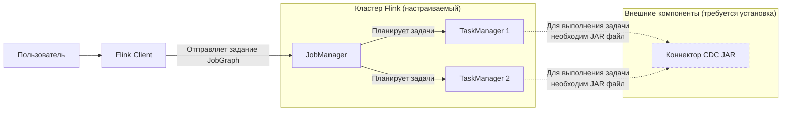

# Проверка состояния Flink кластера
Ваш вопрос о проверке кластера Flink перед накатом CDC очень правильный — начинать нужно именно с этого. Давайте разберем ключевые моменты.

### ✅ Ключевые пункты для проверки
Сначала убедитесь в исправности основных компонентов кластера:

| Компонент | **Как проверить (через командную строку)** | **Что проверить (через веб-интерфейс)** | **Цель проверки** |
| :--- | :--- | :--- | :--- |
| **JobManager (JM)** | Запрос к REST API: `curl http://<JM_HOST>:8081/taskmanagers` | В интерфейсе (`http://<JM_HOST>:8081`) на вкладке **Task Managers** должны отображаться узлы. | Подтверждает, что главный узел кластера работает и видит рабочие узлы. |
| **TaskManager (TM)** | Используйте CLI: `./bin/flink list`. Должен вернуть список заданий (возможно, пустой). | В разделе **Overview** или **Task Managers** должна быть **1+** доступная задача (Task Slot). | Подтверждает, что рабочие узлы запущены и готовы выполнять задачи. |
| **Сеть и доступ** | Проверьте подключение изнутри кластера к вашей PostgreSQL: `telnet <PG_HOST> 5432` | — | Убедиться, что кластер Flink может установить соединение с источником данных. |
| **Конфигурация Flink** | Проверьте путь к `JAVA_HOME`, версию Java (`java -version`). | На главной странице интерфейса во вкладке **Configuration** можно просмотреть ключевые параметры. | Проверка среды исполнения. |

### 🧩 Общая концепция проверки для Flink CDC
Для развертывания Flink CDC принципиально нужны все основные компоненты Flink (Client, JobManager, TaskManager), которые вы уже проверили. Ниже показано, как они взаимодействуют и в чем заключается главная подготовительная задача:

Главное, что **не является частью стандартного дистрибутива Flink** — это сам JAR-файл коннектора (например, `flink-sql-connector-postgres-cdc-3.x.jar`). Именно его вам нужно будет добавить.

### 🛠️ Рекомендуемые дальнейшие шаги

1.  **Подготовьте JAR-файлы коннекторов**. Скачайте необходимые для CDC и StarRocks коннекторы с официальных сайтов (Apache Flink CDC, StarRocks) в соответствии с вашей версией Flink.
2.  **Разместите JAR-файлы в кластере**. Разместите скачанные JAR-файлы в директорию `lib/` на всех узлах TaskManager или укажите путь к ним при запуске задания.
3.  **Проверьте подключение к PostgreSQL**. Убедитесь, что PostgreSQL на всех узлах кластера разрешает подключения от узлов Flink, и что логическая репликация (`wal_level = logical`) настроена корректно.
4.  **Запустите тестовое задание**. Протестируйте кластер и работу коннектора, запустив простую тестовую задачу (например, на чтение одной небольшой таблицы).

Помните, что Flink CDC использует встроенную библиотеку Debezium, поэтому разворачивать отдельный сервис Debezium или Kafka Connect для чтения из PostgreSQL **не нужно**.

