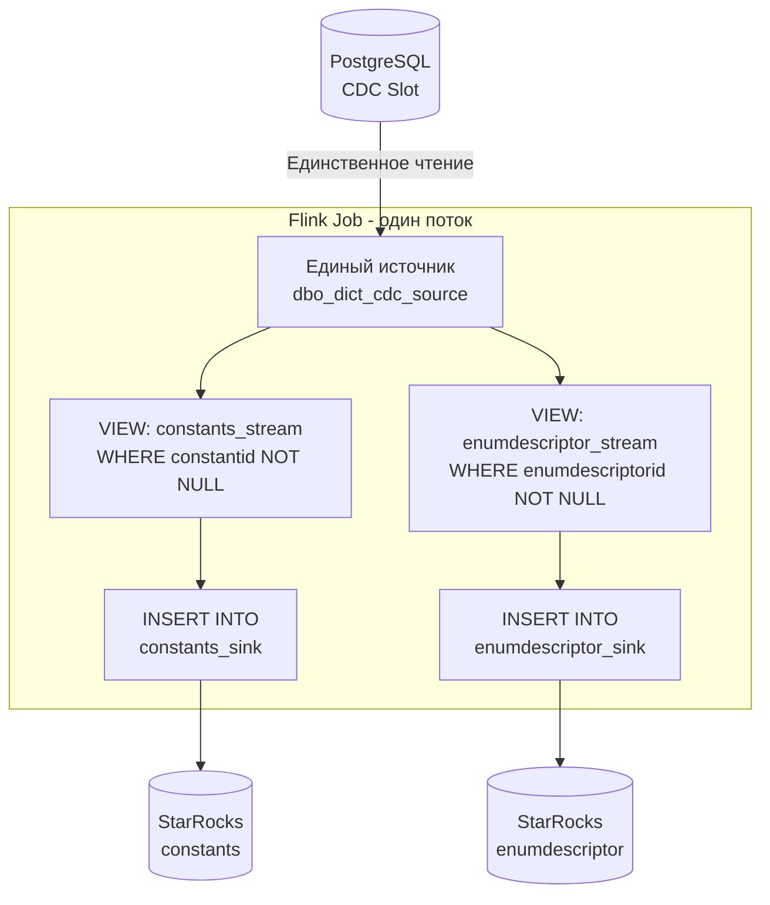

> проблема в том, что как только первый поток начинает что-то вычитывать из объединенного источника,  
> после его вычитывания данные там обнуляются  
> и второму (и следующим) потоку уже ничего не достается
> отсюда идея предварительно захватить данные, отпустив источник
> а уже потом разобрать их по направлениям

##### ...\Work\Tasks\CS-28826 РТК. Настроить BI на demo стенде\cdc\Apache Flink\Test\Streaming ELT from PostgreSQL to StarRocks with Flink SQL one PG slot to many tables threding.sql

А, вот теперь я понимаю корень проблемы!   
Вы говорите про **механизм чтения данных в PostgreSQL CDC**, который действительно работает так: когда слот репликации вычитывает изменения, они "исчезают" для других потребителей.

## 🎯 Решение: ОДИН поток с branching (разветвлением)

Вам нужен **один Flink Job**, который читает из источника и разветвляет поток на два направления:

```sql
-- 1. Создаем ОДИН источник (у вас уже есть dbo_dict_cdc_source)

-- 2. Создаем два TEMPORARY VIEW для фильтрации данных "на лету"
CREATE TEMPORARY VIEW IF NOT EXISTS constants_stream AS
SELECT 
  CAST(constantid AS STRING) as constantid_str,
  constantid,
  key,
  value,
  description,
  insertutcdate,
  extraf,
  extraf_1
FROM `default_catalog`.`cdctest`.`dbo_dict_cdc_source`
WHERE constantid IS NOT NULL;

CREATE TEMPORARY VIEW IF NOT EXISTS enumdescriptor_stream AS
SELECT 
  CAST(enumdescriptorid AS STRING) as enumdescriptorid_str,
  enumdescriptorid,
  enumtypeid,
  name,
  CAST(value AS BIGINT) as value_bigint, -- Преобразование типа
  languageresourceid,
  insertutcdate
FROM `default_catalog`.`cdctest`.`dbo_dict_cdc_source`
WHERE enumdescriptorid IS NOT NULL;

-- 3. Вставляем ОДНОВРЕМЕННО в две таблицы из ОДНОГО источника
BEGIN STATEMENT SET;

INSERT INTO `default_catalog`.`cdctest`.`dbo__constants_sink`
SELECT 
  constantid,
  key,
  value,
  description,
  insertutcdate,
  extraf,
  extraf_1
FROM constants_stream;

INSERT INTO `default_catalog`.`cdctest`.`dbo__enumdescriptor_sink`
SELECT 
  enumdescriptorid,
  enumtypeid,
  name,
  value_bigint as value,
  languageresourceid,
  insertutcdate
FROM enumdescriptor_stream;

END;
```

## 🔧 Почему это работает?

1. **Один слот, одно соединение** - источник `dbo_dict_cdc_source` читает данные **один раз**
2. **Branching** - Flink автоматически размножает поток данных для двух `INSERT` операций
3. **Фильтрация через VIEW** - `WHERE constantid IS NOT NULL` и `WHERE enumdescriptorid IS NOT NULL` гарантируют, что каждая запись попадет только в свой sink

## 📊 Визуализация потока данных



## ⚠️ Если нужно именно материализовать данные

Если по какой-то причине нужно сначала сохранить все данные, а потом обрабатывать:

### Вариант 1: Использовать Kafka как буфер (рекомендуется)
```sql
-- 1. Источник → Kafka
CREATE TABLE cdc_kafka_sink (
  `constantid` STRING,
  `enumdescriptorid` STRING,
  `key` STRING,
  `value` STRING,
  ...
) WITH (
  'connector' = 'kafka',
  'topic' = 'cdc_raw_data',
  'properties.bootstrap.servers' = 'localhost:9092',
  'format' = 'json'
);

-- 2. Вставляем ВСЕ данные из источника в Kafka
INSERT INTO cdc_kafka_sink 
SELECT * FROM dbo_dict_cdc_source;

-- 3. В другом Job'е читаем из Kafka и распределяем
```

### Вариант 2: Файловая система как checkpoint
```sql
-- Сохраняем snapshot во временные файлы
CREATE TABLE temp_snapshot (
  ...
) WITH (
  'connector' = 'filesystem',
  'path' = 'file:///tmp/cdc_snapshot',
  'format' = 'json'
);

INSERT INTO temp_snapshot SELECT * FROM dbo_dict_cdc_source;
-- Потом читаем из temp_snapshot несколькими запросами
```

## 🚀 Рекомендация

**Используйте первый вариант с branching** - это канонический способ во Flink для обработки одного потока несколькими потребителями. Вся магия в `BEGIN STATEMENT SET; ... END;` - это гарантирует, что оба `INSERT` выполняются в рамках **одной транзакции** чтения из источника.

Если запустить этот SQL-скрипт целиком в SQL Client, вы получите один Job, который:
1. Читает данные из PostgreSQL один раз
2. Разделяет их на два потока
3. Пишет в две разные таблицы StarRocks
