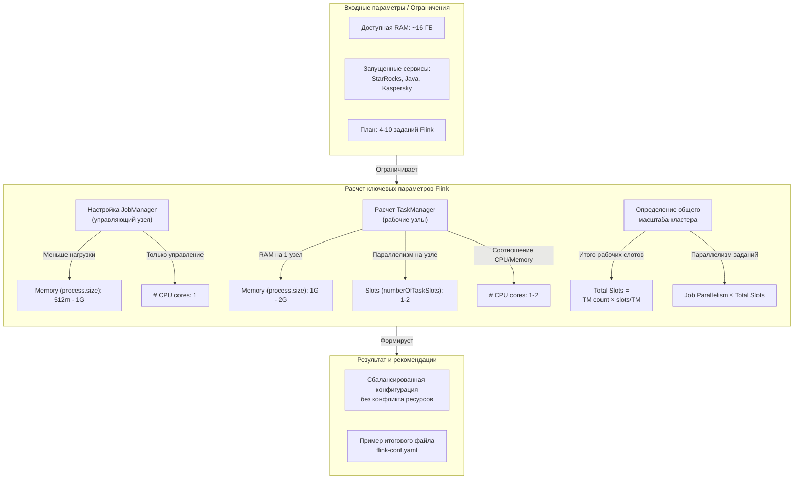

# Общее описание параметров
Для тестовой задачи с синхронизацией 200-300 таблиц важно правильно настроить память и параллелизм Flink, чтобы не было конфликтов с другими сервисами на одном сервере с 16 ГБ памяти. Основные параметры, о которых вы спрашиваете, взаимосвязаны следующим образом:



### 🧩 Подробное описание параметров

Давайте подробно разберем каждый параметр в контексте схемы:

1.  **JobManager Memory (`jobmanager.memory.process.size`)**
    *   **Что делает**: JobManager — это "мозг" кластера. Он координирует задания, управляет контрольными точками, но **не обрабатывает данные**.
    *   **Как настроить**: Для вашей тестовой задачи с несколькими заданиями `512m` — это хорошее стартовое значение. Если заданий станет больше 10, можно увеличить до `1g`. Больше на данной машине не требуется.

2.  **TaskManager Memory (`taskmanager.memory.process.size`)**
    *   **Что делает**: TaskManager — это "мускулы" кластера, которые выполняют задачи и обрабатывают данные. Эта настройка определяет общую память JVM-процесса каждого TaskManager.
    *   **Как настроить**: Выставленные `1024m` (1 ГБ) — хороший баланс. Помните, что эта память делится между всеми **слотами** внутри этого TaskManager.

3.  **Число слотов TaskManager (`taskmanager.numberOfTaskSlots`)**
    *   **Что делает**: Определяет, сколько независимых задач (операторов) может выполняться **параллельно** внутри одного JVM-процесса TaskManager. Слот — это единица параллелизма.
    *   **Как настроить**: Значение `5` при 1 ГБ памяти означает, что на каждый слот будет приходиться примерно `1024m / 5 = 204m`. Этого может быть **маловато**. Лучше установить `2` или `3`, чтобы каждый слот получал больше памяти (~300-500m).

4.  **Параллелизм по умолчанию (`parallelism.default`)**
    *   **Что делает**: Задает количество параллельных экземпляров для каждого оператора (например, `SELECT`, `INSERT`), если явно не указано иное.
    *   **Как настроить**: `4` — разумное значение. **Критически важно**: общий параллелизм всех запущенных заданий не должен превышать **общее количество слотов** в кластере. `parallelism.default` можно и нужно переопределять для каждого задания через `SET` в SQL.

### ⚙️ Пример конфигурации для тестового запуска
Основываясь на схеме и вышеописанных принципах, можно составить сбалансированный конфиг:

```yaml
# flink-conf.yaml
# JobManager - управляющий узел
jobmanager.memory.process.size: 1024m  # 1 ГБ для координации нескольких заданий

# TaskManager - рабочие узлы (планируем запустить 2 экземпляра)
taskmanager.memory.process.size: 2048m  # 2 ГБ на каждый процесс
taskmanager.numberOfTaskSlots: 2        # 2 слота внутри каждого TM

# Общий масштаб кластера (параметры запуска)
# При запуске кластера через start-cluster.sh задаем:
# - Количество TaskManager'ов (например, 2).
# Итого слотов: 2 TM * 2 слота/TM = 4 слота.

# Параллелизм по умолчанию
parallelism.default: 2  # Безопасное значение, меньше общего числа слотов (4)

# Конфигурация для отказоустойчивости и состояния
# Отключаем контрольные точки для синхронизации данных без состояния
execution.checkpointing.interval: 0

# Бэкенд состояния (если позже потребуется, например, для оконных операций)
state.backend: hashmap  # Быстро для состояний в памяти
state.backend.hashmap.memory-threshold: 1048576  # 1 МБ в байтах
```

> **⚠️ Важное замечание о CPU**: В конфигурации Flink нет параметра для явного выделения CPU ядер. В standalone-режиме Flink забирает все доступные ядра процессора. Ограничить можно только на уровне ОС или контейнеризации. При планировании `taskmanager.numberOfTaskSlots` стоит отталкиваться от количества физических ядер.

Эта конфигурация закладывает основу. Чтобы подобрать параметры точнее под вашу нагрузку, важно начать с измерения:

1.  **Сколько TaskManager'ов** вы планируете запустить в своем standalone-кластере?
2.  **Какой общий объем памяти** на сервере вы готовы выделить исключительно под Flink, учитывая, что StarRocks уже использует ~4 ГБ?

