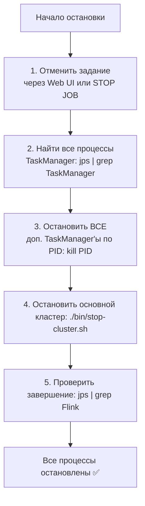

# Остановка конфигурации
Остановка выполняется в порядке, обратном запуску. Вот пошаговый план:

### 🛑 Правильный порядок остановки конфигурации

1.  **Отмена задания (Job)**: Это можно сделать через **Flink Web UI** (`http://<host>:8081`):
    *   На главной странице в списке Jobs найдите ваше задание.
    *   Нажмите на его название, чтобы перейти на детальную страницу.
    *   Нажмите кнопку **"Cancel Job"**. Это безопасно завершит потоковую задачу.
    *   *Альтернативно, в SQL-клиенте: `STOP JOB '<job_id>';`*

2.  **Остановка TaskManager'ов**: Останавливаем процессы в обратном порядке:
    *   Сначала остановите **второй TaskManager**, который запускали вручную. Из директории Flink выполните:
        ```bash
        ./bin/taskmanager.sh stop
        # ИЛИ, если нужно указать конкретный процесс:
        # Найдите его PID: jps | grep TaskManager
        # kill <PID>
        ```
    *   Затем остановите **стандартный (первый) TaskManager** и **JobManager** с помощью скрипта остановки всего кластера:
        ```bash
        ./bin/stop-cluster.sh
        ```

### 📝 Краткая памятка по командам

```bash
# 1. Найти запущенные процессы Flink
jps | grep -E "(TaskManager|JobManager|StandaloneSessionClusterEntrypoint)"

# 2. Отменить задание через Web UI или SQL-клиент

# 3. Остановить дополнительный TaskManager
./bin/taskmanager.sh stop

# 4. Остановить весь кластер
./bin/stop-cluster.sh

# 5. Проверить, что все процессы завершены
jps | grep -E "(TaskManager|JobManager|StandaloneSessionClusterEntrypoint)"
```

### ⚠️ Важные нюансы

*   **Данные в памяти**: При остановке задания (Cancel) все данные, находящиеся в состоянии (`state`), будут потеряны. Поскольку у вас синхронизация без состояния (`checkpointing.interval = 0`), это не страшно.
*   **PostgreSQL CDC слот**: Убедитесь, что в настройках источника указано `'debezium.slot.drop.on.stop' = 'false'`, иначе слот репликации удалится при остановке, что потребует нового полного снимка при следующем запуске.
*   **Порядок важен**: Сначала всегда останавливайте задания, затем TaskManager'ы, и только потом JobManager. Если остановить JobManager при работающих заданиях, они "зависнут" в состоянии потерянного лидера.

После выполнения всех шагов проверьте, что процессы завершились (`jps`), и освободилась память (`free -h`). Готово!

# Замечания
Скрипт `./bin/taskmanager.sh stop` по умолчанию **останавливает только "стандартный" TaskManager**, который был запущен через `start-cluster.sh`. Дополнительные TaskManager'ы, запущенные вручную с параметрами, он **не остановит**. 

### 🎯 Как правильно остановить несколько TaskManager'ов

Для дополнительных TaskManager'ов нужен более точный подход:

1.  **Сначала определите PID (идентификатор процесса)** каждого TaskManager'а:
    ```bash
    jps | grep TaskManager
    ```
    Результат будет примерно таким:
    ```
    12345 TaskManagerRunner
    23456 TaskManagerRunner
    ```

2.  **Остановите каждый дополнительный TaskManager по его PID**:
    ```bash
    # Используйте команду kill (не kill -9!)
    kill 12345
    kill 23456
    ```
    Сигнал `SIGTERM` (по умолчанию от `kill`) позволит процессу корректно завершиться.

3.  **И только потом остановите основной кластер**:
    ```bash
    ./bin/stop-cluster.sh
    ```

### 📝 Алгоритм остановки с несколькими TaskManager'ами

Вот визуализация правильного порядка остановки:



**Важное замечание**: Если запустить `./bin/taskmanager.sh start` несколько раз без указания конфигурационного файла, все экземпляры будут использовать **те же параметры, что и первый TaskManager**. Для разных конфигураций всегда используйте разные конфигурационные файлы или явные параметры командной строки, как вы это делали.

### ⚡ Краткая памятка команд

```bash
# 1. Отменить все задания через Web UI

# 2. Найти все TaskManager'ы
jps | grep TaskManager

# 3. Остановить каждый дополнительный (кроме основного)
kill <PID1> <PID2> ...

# 4. Остановить основной кластер
./bin/stop-cluster.sh

# 5. Проверить
jps | grep -E "(TaskManager|JobManager)"
# Должно быть пусто
```

После этого все процессы Flink будут полностью остановлены.
